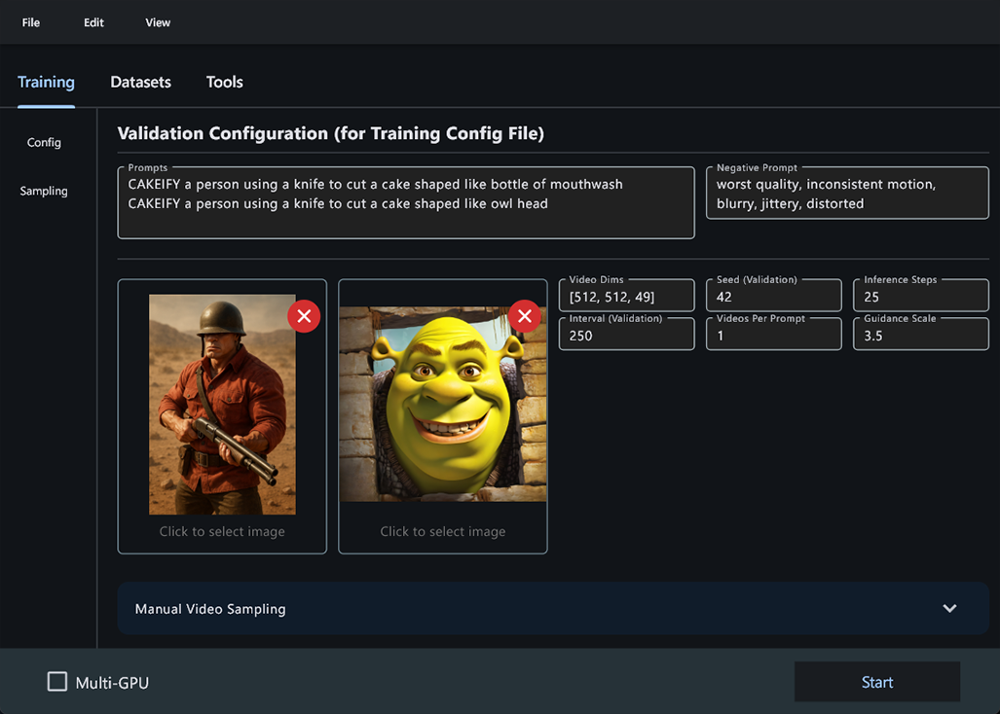

# 🪄 LTX-Wizard-GUI

A simple graphical user interface (GUI) for [Lightricks' LTX-Video-Trainer](https://github.com/Lightricks/LTX-Video-Trainer), built with [Flet](https://flet.dev/).

## ✨ About

This project provides an easy-to-use desktop GUI for the LTX-Video-Trainer, making it accessible without command-line usage. It is built using the Flet Python framework.

- Adapted for simple installation with `virtualenv` and Windows systems.
- Uses Torch 2.8 nightly and cu128 for optimal performance and compatibility NVIDIA Blackwell.

---
## 🛠️ Installation

You need any version of Python installed on your system.

1. Run `venv_setup.bat`
   - This will set up a virtual environment and install all necessary dependencies.
2. Run `LTX_GUI.bat`
   - This will launch the GUI application.

---

## 🚧 WIP

- The blockswap feature is currently experimental and not functional. (Add PR if you know how to add it please) 
- Please keep the blockswap parameter set to 0 for now.

---

## 🚀 Usage

- All required files are located within the workspace folder.
- Models will be downloaded to local `models` folder.
- Add/move transformer to `models/transformer/hg-version-name/hg-version-name.safetensors` if you don't want to redownload it

### Data Preparation

1. Create a new folder for your videos within the `workspace/datasets` directory.
2. In the GUI, navigate to the "Datasets" tab. Your new dataset folder will appear in the dropdown list.
3. Add captions to your videos, either automatically or manually. Completing this step will update the `cap` status to `yes` for your dataset.
4. If necessary, choose a preprocessing model and set the bucket size. (Please refer to the original repository documentation for detailed instructions on these settings).
5. Optionally, add a trigger word for your dataset. You do not need to manually add this word to every caption.
6. Start the preprocessing task. Upon successful completion, the `proc` status for your dataset will be updated.

### Training

1. Navigate to the "Training" tab.
2. Select your desired configuration and the dataset you wish to train on.
3. Click the "Start" button to begin the training process.

### Sampling

The "Sampling" subtab allows you to run inference tests on your model during the training process.

---

## ⌨️ Hotkeys

- `ctrl + S` - save
- `ctrl + Shift + S` - save as
- `ctrl + O` - open
- `]` - next video
- `[` - previous video
- `C` - hold before changing cropping area for aspect ratio lock 

---

---

🧪 **Alpha version:**  
This is an early test release—expect bugs, weirdness, and surprises! If something breaks, just laugh and try again.

---

Enjoy training with a friendly interface! 🎬 